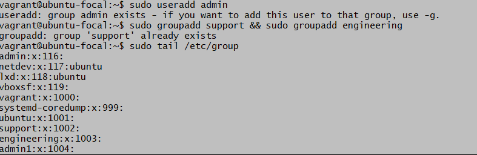

# Altschool-cloud-exercises-project    
## CREATING SUDOERS, USER GROUPS AND GENERATING SSH KEYS 
 For this exercise, three groups consisting of admin,support and engineering were first created in the following ways:

### CREATION OF USER GROUP FOR ADMIN AND ADDING ADMIN TO SUDOERS
While trying to create an admin group, foundout it already existed and hence no need to create another instead decided to work with the already created one. Used the command;

 `cat /etc/passwd`

  which is a plain text-based database that contains information for all user accounts on the system. To view the admin used the command:

  ` sudo tail /etc group`
  
   which lists about the last ten groups to view it properly. These commands are attached below. 

Since admin group already exists next thing was to edit the file and add it to sudoers by granting it all the necessary permission using the command:

`sudo visudo /etc/sudoers`

### User privilege specification
root    ALL=(ALL:ALL) ALL

### Members of the admin group may gain root privileges
%admin ALL=(ALL:ALL) ALL

### Allow members of group sudo to execute any command
%sudo   ALL=(ALL:ALL) ALL

This opened up a nano editor in which i edited the permission for the admin and made it a sudoers as shown above.

### CREATED USER GROUP FOR SUPPORT AND ENGINEERING 
Then i created the support and engineering groups by using the command:

`sudo groupadd support && sudo groupadd engineering`

This was then created to view it i used :

`cat /etc/group`

### CREATION OF 3 USERS FOR EACH GROUP

Then i went ahead and created users for each of the groups by using the command:
`sudo -g -m -s /usr/bin/bash username`

In which i created Nancy as admin user, Michael in support group and Grace in engineering.

 ### GENERATION OF SSH KEYS FOR USER IN ADMIN GROUP
 I switched to Nancy who is the admin user by using the command:

 `sudo su -Nancy`

Then generated the ssh key for the admin user Nancy by using the command:

`ssh-keygen`

